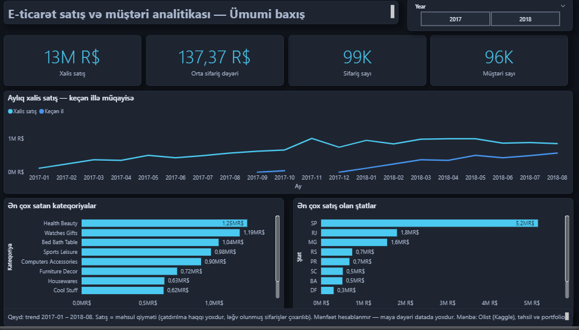
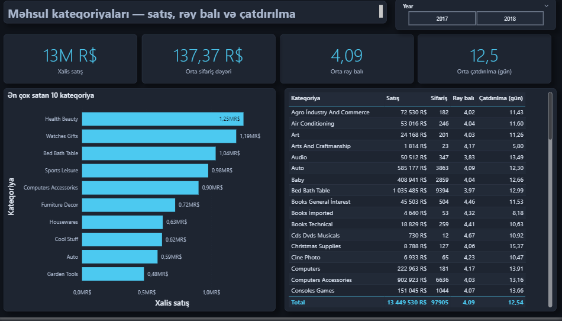
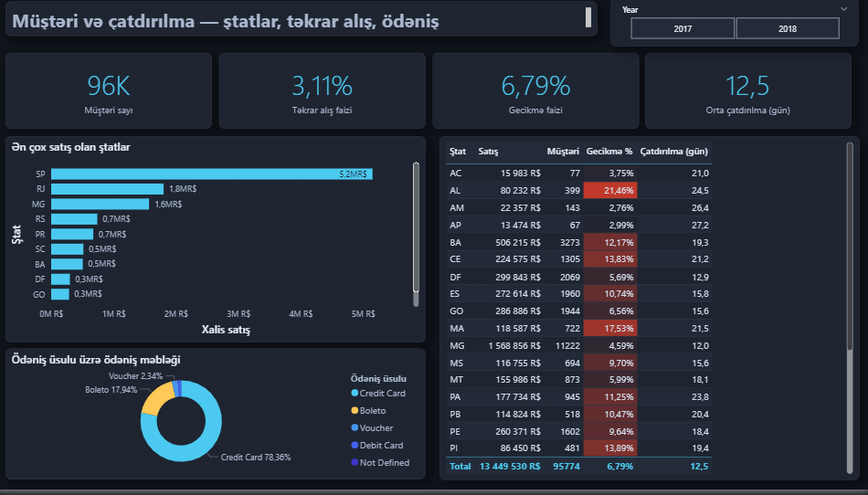
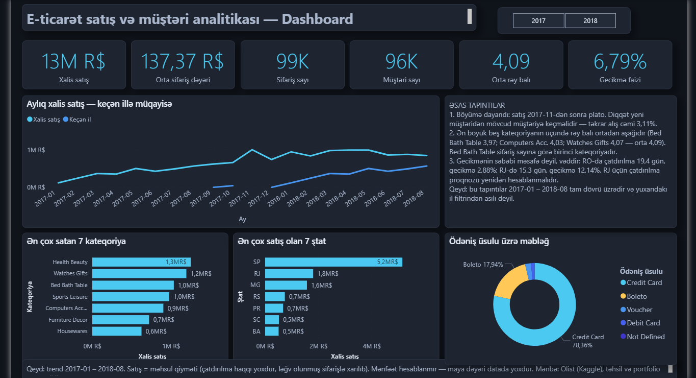

# E-commerce Sales & Customer Analytics Dashboard

**Power BI · SQL · Power Query (M) · DAX**

Braziliya e-ticarət marketplace-i Olist-in 2016–2018 satış datası üzərində qurulmuş analitika layihəsi: xam CSV-lərdən data keyfiyyəti yoxlamasına, star schema modelə, DAX measure-lərə və 4 səhifəlik interaktiv hesabata qədər.

## Layihə nə cavab verir

| # | Biznes sualı | Səhifə |
|---|---|---|
| 1 | Gross/Net satış nə qədərdir, ləğv olunanın payı nədir? | Ümumi baxış |
| 2 | Satış aylar üzrə necə dəyişir? | Ümumi baxış |
| 3 | AOV nə qədərdir? | Ümumi baxış |
| 4 | Hansı kateqoriyalar ən çox satır, rəy balı və çatdırılması necədir? | Kateqoriyalar |
| 5 | Müştərilərin neçə faizi təkrar alış edir? | Müştəri və çatdırılma |
| 6 | Hansı ştatlar ən çox satış gətirir? | Müştəri və çatdırılma |
| 7 | Çatdırılma neçə gün çəkir, gecikmə hansı regionlarda çoxdur? | Müştəri və çatdırılma |
| 8 | Ödəniş üsulları necə paylanır? | Müştəri və çatdırılma |

Nəticələr və tövsiyələr: [`04_documentation/insights.md`](04_documentation/insights.md)

## Əsas tapıntılar

- Satış 2017-11-dən sonra platoya çıxıb — böyümə dayanıb.
- Ən böyük beş kateqoriyanın üçündə rəy balı ümumi ortadan (4,09) aşağıdır: Bed Bath Table 3,97, Computers Accessories 4,03, Watches Gifts 4,07. Ən zəifi Bed Bath Table-dır — eyni zamanda sifariş sayına görə birinci kateqoriya.
- Müştərilərin cəmi **3,11%-i** təkrar alış edib (2017-01 – 2018-08 dövründə aktiv 95.774 müştəri üzrə; bütün dövr üzrə 2.997 / 96.096 = 3,12%).
- Gecikmə coğrafiyaya görə kəskin dəyişir: MG 4,59%, RJ 12,14%, AL 21,46%. RO-da çatdırılma 19,4 gün olsa da gecikmə 2,88%-dir — yəni problem uzun müddətdə yox, **vədin real olmamasındadır**.

**Gecikmə tərifi:** sifariş gecikmiş sayılır, əgər çatdırılma **tarixi** təxmini çatdırılma tarixindən sonradırsa. Müqayisə tarix səviyyəsindədir, saat səviyyəsində deyil — `order_estimated_delivery_date` sütununda saat yoxdur (00:00), ona görə timestamp müqayisəsi eyni gün günorta çatdırılan sifarişi də gecikmiş sayardı (6,77% əvəzinə 8,11%).

## Hesabat səhifələri

| Səhifə | Nə göstərir |
|---|---|
| Ümumi baxış | KPI-lar, aylıq trend (keçən illə müqayisə), ən çox satan kateqoriya və ştatlar |
| Kateqoriyalar | Kateqoriya üzrə satış, rəy balı və çatdırılma müddəti |
| Müştəri və çatdırılma | Təkrar alış, gecikmə faizi, ştat üzrə kəsim, ödəniş üsulları |
| Dashboard | Bir ekranda ümumi mənzərə və əsas tapıntılar |






## Texniki quruluş

**Data axını:** xam CSV → SQL profiling (SQLite) → Power Query staging → star schema → DAX → hesabat

**Model:** multi-fact star schema
- Fakt: `FactSales` (sifariş sətri), `FactOrders` (sifariş başlığı), `FactPayments` (ödəniş)
- Ölçü: `DimCustomer`, `DimProduct`, `DimSeller`, `DimDate` (date table kimi işarələnib)
- Filtr `DimDate → FactOrders → FactSales` istiqamətində axır

**21 DAX measure** — hamısı SQL/Python ilə hesablanmış nəzarət rəqəmləri ilə yoxlanıb (`03_powerbi_file/dax/measures.dax`).

**9 SQL sorğusu** — sətir sayları, təkrarlar, orphan yoxlaması, 23 məntiqi yoxlama (`02_sql/`).

## Qovluq quruluşu

```
01_raw_data/            xam CSV-lər (GitHub-a yüklənmir)
02_sql/                 01–09 sorğular + results/
03_powerbi_file/        .pbix, power_query/*.m, dax/measures.dax, theme/
04_documentation/       data quality, data dictionary, qərarlar, biznes sualları, insights
05_portfolio_exports/   hesabat səhifələrinin ekran şəkilləri
LICENSE                 MIT — kod və sənədləşmə üçün
```

## Datanın məhdudiyyətləri (açıq şəkildə)

- **Mənfəət və marja hesablanmır** — datasetdə maya dəyəri yoxdur.
- Endirimin təsiri, konkret məhsul adları, müştəri demoqrafiyası və marketinq kanalı datada yoxdur.
- Trend analizi 2017-01 – 2018-08 dövrü üzrədir; natamam aylar (2016-09, 2016-12, 2018-09, 2018-10) qrafiklərdən filtrlənib.
- Satış = `order_items.price`; `payment_value` ilə toplanmır (iki dəfə hesablama riski).
- Carrier tarixlərində 166 məntiqsiz qeyd var, ona görə yalnız alış → müştəri müddəti ölçülür.
- 775 sifarişin məhsul sətri yoxdur (əsasən unavailable/canceled) və AOV-yə daxil edilmir.

Gecikmə faizi ilə rəy balı arasındakı əlaqə (r = −0,89) **ştat səviyyəsində** ölçülüb, yəni ekoloji korrelyasiyadır və ayrı-ayrı sifarişlərə şamil edilə bilməz; səbəb-nəticə iddiası edilmir.

Tam siyahı: [`04_documentation/data_quality_report.md`](04_documentation/data_quality_report.md)

## Data mənbəyi və lisenziya

Brazilian E-Commerce Public Dataset by Olist (Kaggle) — **CC BY-NC-SA 4.0**.
Publicly available dataset was used for educational and portfolio purposes.
Xam CSV-lər bu repoda saxlanılmır; datanı Kaggle-dan yükləyib `01_raw_data/` qovluğuna qoymaq lazımdır.

Bu repodakı kod və sənədləşmə (SQL, DAX, Power Query M, Markdown) **MIT** lisenziyası altındadır — bax [`LICENSE`](LICENSE). MIT datasetə şamil edilmir; dataset yuxarıdakı öz şərtləri ilə qalır.
